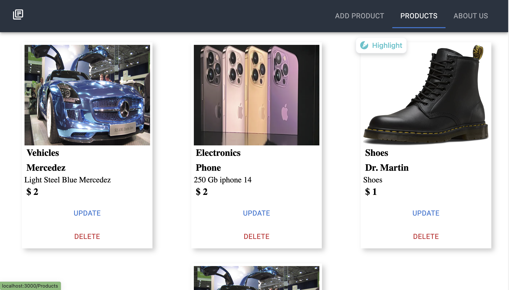

# This is my first Ecomerce simple  Store. As the store start making money features such as authentication and Authorization, Adding products to carts and many more will be added. 

This Store allows anybody to Add Products and Delete and update Products. The website also consumes data from external Source Web API  incase we ran out of Products.


<h3> Technologies used to make this Simple Store </h3>
<hr>


```
HTML
CSS
Javascript
Reactjs
MaterialUI( Another React FrontEnd Library)
NodeJs
Express
MongoDB
Mongoose
FakeStoreAPI

```
```
As a User I have the ability to
- explore page 
- navigate to different sections
-Create Product and list on my site for sale
-Delete and UpDate Product
``` 
CRUD PRODUCTS



backend:https://github.com/drnepal/simple-store-backend

Routes 


  


ERD